# Architecture

This document gives the system-level view of the search engine tool
— what each module does, how the data flows through them, how the
on-disk schema has evolved, and which design patterns recur across
the codebase. The companion [README](../README.md) covers
user-facing behaviour and the [CHANGELOG](../CHANGELOG.md) traces
every release back to its implementation step. New contributors
should start with the README, then come here to understand *why*
the code is organised the way it is.

---

## 1. Repository layout

```
search-engine-tool/
├── src/                          Production code (covered by mypy and ruff)
│   ├── crawler.py                BFS crawler + Session/Retry + robots.txt
│   ├── robots.py                 RobotsPolicy adapter over urllib.robotparser
│   ├── parser.py                 HTML → text + ParsedFields extraction
│   ├── tokenizer.py              Stopwords + Porter Step-1 stemming
│   ├── indexer.py                Index dataclass + build/save/load (atomic)
│   ├── ranker.py                 Ranker protocol + TFIDFRanker + BM25Ranker
│   ├── retrieval.py              DAAT/TAAT + conjunctive + skip-pointer + phrase
│   ├── search.py                 find_pages_with_snippets, facets, did-you-mean
│   ├── snippet.py                Snippet extraction with highlight markup
│   ├── suggest.py                Levenshtein + linear / BK-tree paths
│   ├── bktree.py                 Burkhard-Keller metric tree
│   └── main.py                   CLI shell (build / load / print / find)
│
├── tests/                        Unit + integration + property + performance
├── benchmarks/                   Out-of-CI performance comparisons
│   ├── corpus.py                 Deterministic synthetic input generators
│   ├── run_benchmarks.py         DAAT/TAAT/conjunctive/skip benchmark
│   └── run_suggest_benchmark.py  Linear vs BK-tree benchmark
│
├── docs/
│   ├── architecture.md           This file
│   └── api/                      pdoc-generated HTML (gitignored)
│
├── data/                         Local index outputs (gitignored)
├── .github/workflows/ci.yml      ruff + mypy + tests on Python 3.10/3.11/3.12
├── pyproject.toml                Build metadata + ruff + mypy + coverage config
├── README.md                     User-facing overview
├── CHANGELOG.md                  Keep-a-Changelog format, one entry per tag
├── CONTRIBUTING.md               Workflow guide for contributors
└── VIDEO_SCRIPT.md               5-minute submission video script (local)
```

---

## 2. Module decomposition

Each module owns exactly one concern. Cross-module collaboration
happens through small dataclasses and named functions, never
through globally mutable state.

| Module | Responsibility | Key types | Lecture / textbook |
|---|---|---|---|
| `crawler.py` | Fetch HTML over HTTP, respect robots.txt and the 6 s politeness floor, walk the link graph in BFS order | `QuoteCrawler`, `CrawledPage`, `CrawlerError` | L9 Web Crawling |
| `robots.py` | Parse `Disallow` / `Allow` / `Crawl-delay` and decide reachability | `RobotsPolicy` | L9 Web Crawling |
| `parser.py` | Strip script/style, extract structured fields (title, quote text, author, tag) and a flat body | `ParsedFields` | L11 Parsing and Tokenisation |
| `tokenizer.py` | Lowercase, split, optional stopword filter, optional Porter Step-1 stemming | `TokenizerConfig`, `tokenize` | L11 Parsing and Tokenisation |
| `indexer.py` | Build the inverted index with integer doc-ids and per-field statistics; atomic save/load with schema version guard | `Index`, `Posting`, `FieldStats` | L12 Indexing |
| `ranker.py` | TF-IDF and BM25 implementations behind a single Protocol | `Ranker`, `TFIDFRanker`, `BM25Ranker` | L12 Indexing — ranking |
| `retrieval.py` | DAAT, TAAT, conjunctive intersection (simple + skip-pointer), phrase match via position offsets | `document_at_a_time`, `term_at_a_time`, `conjunctive_match_with_skip`, `phrase_retrieval` | L13 Query Processing |
| `search.py` | Top-level query API: facet parsing, find with snippets, did-you-mean | `find_pages_with_snippets`, `format_did_you_mean`, `parse_facets`, `filter_by_facets` | L13 advanced query processing |
| `snippet.py` | Pick a 60–80 char body excerpt around the first match, bracket query terms | `extract_snippet` | Manning et al. Ch. 8.7 |
| `suggest.py` | Levenshtein distance + linear/BK-tree paths for spelling correction | `levenshtein_distance`, `suggest_corrections`, `BKTREE_MIN_VOCAB` | Manning et al. Ch. 3.3 |
| `bktree.py` | Burkhard-Keller metric tree for sub-linear edit-distance lookup | `BKTree` | Burkhard & Keller 1973 |
| `main.py` | Interactive shell for the four brief-required commands plus phrase / facet syntax | `handle_command`, `run_shell` | — |

---

## 3. Ingestion pipeline

How a `build` command turns a seed URL into a queryable index:

```mermaid
flowchart LR
    A([Seed URL]) --> B[QuoteCrawler<br/>BFS frontier]
    B -->|GET via Session + retry| C[response.text]
    C --> D[parse_html_to_fields<br/>title/quote/author/tag/body]
    D --> E[CrawledPage]
    E --> F[tokenize<br/>+ optional stopwords<br/>+ optional Porter Step 1]
    F --> G[build_index<br/>per-doc-id postings<br/>+ Lecture 12 fields/extents]
    G --> H[(Index<br/>postings + documents_text)]
    H --> I[save_index<br/>tmp file + os.replace]
    I --> J([data/index.json])
```



**Per-page work** (in order):

1. **Politeness** — the crawler sleeps `max(6 s, Crawl-delay)` between
   successive requests. Failure to do this against a real host would
   violate the brief.
2. **Robots filter** — the URL passes through `RobotsPolicy.is_allowed`
   before any network call. Disallowed URLs are silently dropped.
3. **HTTP fetch** — one `requests.Session` per crawler, mounted with
   a urllib3 `Retry(total=3, status_forcelist=[502,503,504])`. Idempotent
   GETs only; 4xx is a client bug and is not retried.
4. **Parse** — BeautifulSoup drops `<script>` and `<style>` first, then
   `ParsedFields` is built by traversing the `.quote` blocks.
5. **Tokenise body** — feeds the top-level `frequency` / `positions`
   statistics that `find_pages` and `print_word` consume.
6. **Tokenise each named field** — separately for `title` / `quote_text`
   / `author` / `tag`. Per-field counts live under `posting["fields"]`
   so a future BM25F-style weighting can read them without changing
   the index layout.
7. **Persist body text** — `CrawledPage.text` is copied to
   `Index.documents_text[doc_id]` so the v1.4.0 snippet generator can
   quote context at query time without re-fetching the page.

**Atomic save** (`save_index`) writes the JSON payload to a sibling
`<path>.tmp` file, fsyncs it, then `os.replace` swaps it into place.
`os.replace` is atomic on POSIX (`rename(2)`) and Windows
(`MoveFileExW` + `MOVEFILE_REPLACE_EXISTING`), so a power loss or
Ctrl+C mid-write leaves the previous good `index.json` untouched.

---

## 4. Query pipeline

How `find` turns a query string into a ranked list with snippets:

```mermaid
flowchart TD
    A([find &lt;args&gt;]) --> B[parse_facets<br/>split args into facets + free text]
    B --> C{free text<br/>shape?}
    C -->|empty + facets| D[facet-only browse:<br/>all doc_ids → filter]
    C -->|single quoted| E[find_phrase_with_snippets]
    C -->|words| F[find_pages_with_snippets]
    E --> G[tokenize query]
    F --> G
    G --> H{retrieval}
    H -->|phrase| I[phrase_retrieval<br/>position-offset intersect]
    H -->|conjunctive| J[conjunctive_retrieval<br/>simple or skip-pointer]
    I --> K[filter_by_facets]
    J --> K
    D --> K
    K --> L[Ranker.score per doc<br/>TF-IDF or BM25]
    L --> M[extract_snippet<br/>+ [highlight] markup]
    M --> N([URL + snippet list])

    H -.0 results.-> O[suggest_for_query<br/>BK-tree if vocab ≥ 500]
    O --> P[format_did_you_mean]
    P --> Q([Did you mean: ...?])
```

**Layered design** — every stage is invocable independently with no
hidden coupling:

* **Retrieval** (`src/retrieval.py`) takes `Index` + token list and
  returns `(doc_id, score)` pairs. It does not know about URLs,
  facets, or snippets.
* **Search** (`src/search.py`) coordinates retrieval, facet
  filtering, and snippet generation. It does not know about the CLI.
* **CLI** (`src/main.py`) parses the user line, routes phrase vs
  conjunctive vs facet-only, formats the output.
* **Suggest** (`src/suggest.py`) only sees a vocabulary and a list of
  unknown tokens. It does not know about find or facets.

This separation is what makes the test suite tractable: each layer
can be exercised with hand-built fixtures, and the integration
tests in `tests/test_integration.py` verify they compose correctly
on a real (stubbed) crawl.

---

## 5. Schema evolution

`Index` carries an `INDEX_VERSION` sentinel that `load_index`
checks before reading the rest of the file. Any version mismatch
raises with a clear "rebuild via `build`" message — never a silent
half-load.

| Version | Tag | Change |
|---|---|---|
| 1 | v0.1.0 | Initial single-file inverted index |
| 2 | v0.5.0 | Move from URL-keyed postings to integer `doc_id` keys with a separate `Index.documents` URL map (Lecture 12 layout) |
| 3 | v0.6.0 | Add per-field statistics (`posting["fields"]`) for Lecture 12 "Fields and Extents" |
| 4 | v0.13.0 | Persist `TokenizerConfig` on the index so search-time tokenisation matches build-time |
| 5 | v1.4.0 | Add `Index.documents_text` so the snippet generator can quote body context without re-fetching pages |

The v1.7.0 TypedDict refactor of `Posting` is **runtime-equivalent**
to v5 — the in-memory shape, JSON serialisation, and load semantics
are byte-identical. Only the static type changed (from
`dict[str, object]` to a `TypedDict`), so existing v5 files load
unchanged on the new code path.

---

## 6. Recurring design patterns

The codebase reuses a small set of design patterns deliberately,
making the architecture predictable for new contributors.

### 6.1 Dual implementations behind one API

Where an optimised algorithm replaces a simpler one, both are kept
in the codebase and a property test pins their results equivalent.
The optimised version is the production path; the simple version is
the documentation oracle.

Instances:

* `retrieval.py::conjunctive_match` (naive) vs `conjunctive_match_with_skip`
  (Lecture 13 skip pointers). Pinned by a 20-trial property test.
* `suggest.py::_suggest_via_linear_scan` vs `_suggest_via_bktree`
  (Burkhard & Keller 1973). Pinned by a 4 800-assertion property
  test (60 random vocabs × 20 random targets × 4 thresholds).

This pattern lets the report present the trade-off honestly — "we
implemented the simple version first, then accelerated it, and the
test suite proves they agree on every input we can throw at them".

### 6.2 Static threshold dispatch

When an optimisation only pays off above a certain scale, the
dispatch is a constant compared against the input size:

* `suggest.py::BKTREE_MIN_VOCAB = 500` — below this the linear scan
  wins because the tree-build cost is not amortised.

The threshold itself is justified by a benchmark, not chosen by
intuition — see `benchmarks/run_suggest_benchmark.py`.

### 6.3 Reference cache via setattr

The BK-tree built for `Index.postings` lives across `find` calls in
one CLI session. Instead of adding a dataclass field to `Index`,
the cache is set via `setattr(index, "_bktree_cache", tree)` so
the data shape stays pure — equality, `save_index`/`load_index`,
and `repr` all ignore the cache.

This keeps the storage layer (`indexer.py`) free of dependencies
on the spelling layer (`bktree.py`).

### 6.4 Atomic file writes

Any path that produces a file the next session will read goes
through a `<path>.tmp` + `os.replace` cycle so half-writes never
corrupt the destination. Currently this is `save_index` only, but
the same pattern would apply to any future on-disk artefact.

### 6.5 Branch-per-step Git workflow

Every roadmap step (v0.1.0 → v1.7.0) is its own feature branch
named `feature/<step-name>-vN.M.K`, merged into `main` with
`--no-ff` to preserve the topology, and tagged with an annotated
tag carrying a short release note. The pattern is documented in
[CONTRIBUTING.md](../CONTRIBUTING.md) so a new contributor
extending the project can follow it without guessing.

---

## 7. Testing strategy

Four layers, each invoked by `python -m unittest discover` and
covered by CI:

* **Unit** — module in isolation against hand-built fixtures
  (`test_crawler`, `test_indexer`, `test_ranker`, `test_retrieval`,
  `test_search`, `test_suggest`, `test_bktree`, …).
* **Integration** (`test_integration.py`) — the whole pipeline
  end-to-end against a stub HTTP site fixture; covers crawl →
  parse → build → save → load → find with snippets.
* **Property** (`test_properties.py`, `test_bktree.py`,
  `test_retrieval.py`) — randomised inputs verifying invariants
  (save/load identity, phrase ⊂ conjunctive, BM25 ≥ 0, BK-tree ≡
  linear scan, …). Seeds are fixed so failures are reproducible.
* **Performance** (`test_performance.py`) — coarse wall-clock
  budgets on a 500-page synthetic corpus; catches a 100× regression
  but tolerates CI runner variance.

CI runs all four under `coverage.py` with `--fail-under=85`. The
benchmark scripts in `benchmarks/` are not exercised on CI — their
timing noise from shared runners would make every threshold either
too loose to catch regressions or too strict to stay green.

---

## 8. Benchmark methodology

Two independent benchmark surfaces, both following the same recipe:

* **Retrieval** (`benchmarks/run_benchmarks.py`) — compares DAAT,
  TAAT (with TF-IDF and BM25 each), conjunctive simple, and
  conjunctive with skip pointers on 250 / 500 / 1 000 / 2 000-page
  synthetic corpora.
* **Suggest** (`benchmarks/run_suggest_benchmark.py`) — compares
  linear scan vs BK-tree on 100 / 500 / 2 000 / 5 000-term
  synthetic vocabularies, in both `clustered` and `random` styles.

Both runners:

1. Discard the first call per cell as a warmup (absorbs first-call
   costs like dict resizing, JIT, allocation).
2. Take 5 timed repetitions and report median + IQR. IQR is
   preferred over min/max for robustness to outliers, following IR
   evaluation convention.
3. Run the memory pass separately under `tracemalloc`. The
   `tracemalloc` overhead is ~5–10× the underlying call cost, so
   mixing it into the timing pass would contaminate the numbers.
4. Embed full reproducibility metadata in every output: git SHA,
   Python version, platform, processor, hostname, run timestamp,
   exact parameters.
5. Emit three artefacts per run — JSON (full data, machine readable),
   CSV (flat schema for Excel / pandas), and Markdown (report-ready
   tables) — all under `benchmarks/results/` which is gitignored.

---

## 9. Extension points

Concrete places the architecture is designed to extend cleanly:

* **More rankers.** `Ranker` is a `Protocol`; any class with a
  `score(index, query_tokens, doc_id) -> float` method plugs in.
  Candidates: BM25F (per-field weighted), cosine-similarity over
  TF-IDF vectors, learning-to-rank.
* **Compressed postings.** `Posting` is a TypedDict over JSON
  primitives. A v6 schema could encode `positions` as variable-byte
  delta-gaps without changing the runtime surface of `retrieval.py`
  — only the (de)serialiser needs to swap implementations.
* **Phrase variants.** `phrase_match` is one function in
  `retrieval.py`. Proximity queries (terms within k positions),
  ordered vs unordered phrases, and slop tolerance fit the same
  shape.
* **Faceted UI.** `parse_facets` already produces a structured dict;
  a web frontend reading the same indexes could surface the facets
  as checkboxes without touching the core.
* **Dynamic snippets.** `snippet.py` implements Manning Ch. 8.7's
  *static* strategy. The *dynamic* strategy (rank candidate
  sentences by query-term density) would slot under the same
  `extract_snippet` signature.

---

## 10. References

* Burkhard, W. A. and Keller, R. M. (1973). "Some approaches to
  best-match file searching." *Communications of the ACM* 16(4):
  230–236. — `src/bktree.py`.
* Croft, W. B., Metzler, D. and Strohman, T. (2010). *Search
  Engines: Information Retrieval in Practice*. — BM25 (Ch. 5),
  benchmark methodology.
* Manning, C. D., Raghavan, P. and Schütze, H. (2008). *Introduction
  to Information Retrieval*. — Ch. 3 dictionaries and tolerant
  retrieval (BK-tree, Levenshtein), Ch. 8.7 snippet generation.
* Porter, M. F. (1980). "An algorithm for suffix stripping."
  *Program* 14(3): 130–137. — `src/tokenizer.py` Step 1 stemmer.
* Robertson, S. E. and Walker, S. (1994). "Some simple effective
  approximations to the 2-Poisson model for probabilistic weighted
  retrieval." *SIGIR* — Robertson IDF + BM25 length normalisation.
* Wagner, R. A. and Fischer, M. J. (1974). "The string-to-string
  correction problem." *Journal of the ACM* 21(1): 168–173. —
  `src/suggest.py::levenshtein_distance`.

Module-level docstrings in `src/` repeat the references for the
specific function or class they motivate, so cross-referencing
implementation and citation is one click in any editor with
go-to-definition.
